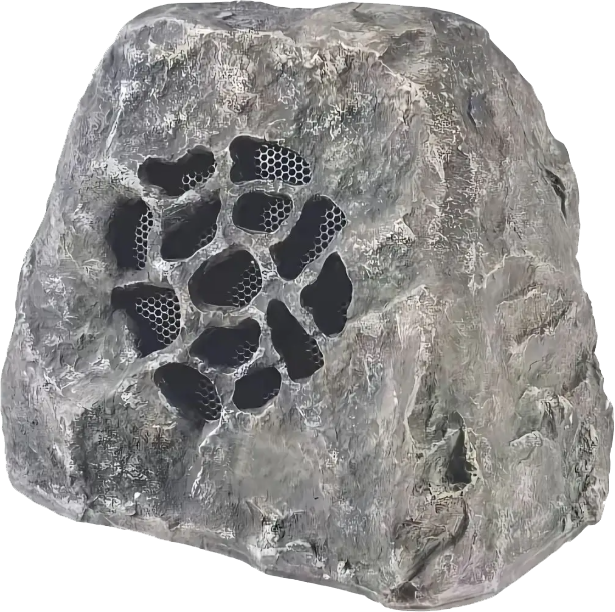

<h1 align="center">Explaining Stones</h1>

<p align="center">一块讲解石</p>

## 功能

- **多颗石头**：桌面上最多三颗，位置、远近与静音各自独立
- **逐像素透明**：轮廓外不挡鼠标
- **投影阴影**：随远近一同缩放
- **播放列表**：打开文件即加入，条目可删除或单曲循环
- **老式播放器音效**：爆豆声与老式收音机声可分别开关
- **三维声源**：每颗石头各自做左右声像、双耳时间差与距离衰减，汇入同一输出设备
- **立体声开关**：关闭后左右声道相同

<p align="center">
  
</p>

## 交互

| 操作 | 效果 |
|---|---|
| 单击桌宠 | 开关这一颗石头的声音（静音时半透明显示） |
| 拖动桌宠 | 移动位置 |
| 右键桌宠 | 打开界面 / 移除这一颗石头 / 关闭（仅剩一颗时不显示移除） |
| 左键或右键托盘图标 | 打开菜单 |
| 托盘菜单「播放 / 暂停音乐」 | 全局播放 / 暂停 |
| 托盘菜单「添加 / 移除石头」 | 增减石头（1~3 颗，到限置灰） |

「设置…」中，「石头」页为只读位置视图与石头条目（名称、静音、移除），右上角可添加石头；「音效」页顶部按现有石头列出选择按钮（石头 1..N），末尾「＋」添加、满三颗置灰，X/Y/Z 滑块与三维示意图只作用于所选石头，爆豆声 / 老式收音机声 / 立体声为全局开关。

## 运行环境

- Windows 10 1809（build 17763）或更高
- .NET 9 桌面运行时
- x64

## 构建

```powershell
dotnet build ExplainingStones.csproj -c Release
```

产物位于 `bin\Release\net9.0-windows10.0.19041.0\win-x64\`，运行其中的 `Explaining Stones.exe`。

## 音乐

播放列表管理曲目：打开文件即加入列表，条目可删除或设为单曲循环。首次运行内置 `theme.mp3`，支持 mp3 / wav / m4a / flac。

## 配置

设置保存在 `%AppData%\ExplainingStones\`：

| 文件 | 内容 |
|---|---|
| `playlist.txt` | 播放列表 |
| `current.txt` | 当前曲目下标 |
| `hiss.txt` | 老式收音机声开关 |
| `crackle.txt` | 爆豆声开关 |
| `stereo.txt` | 立体声开关 |
| `stones.txt` | 各石头的位置与静音（每行一颗） |
| `spatial.txt` | 新石头的默认远近 Z |

## 许可证

[MIT](LICENSE)
